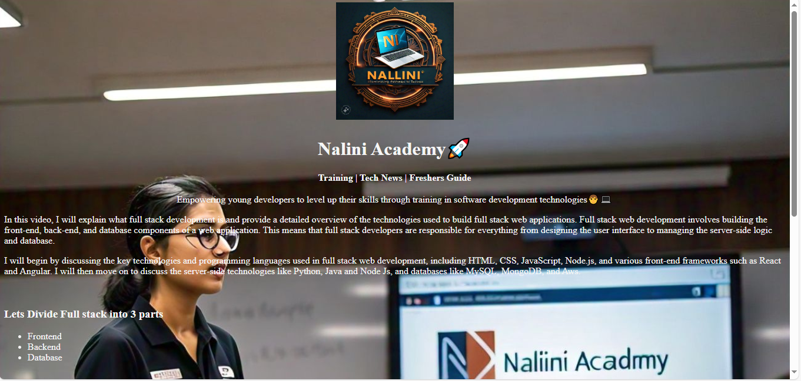
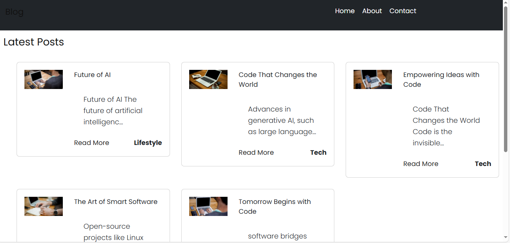
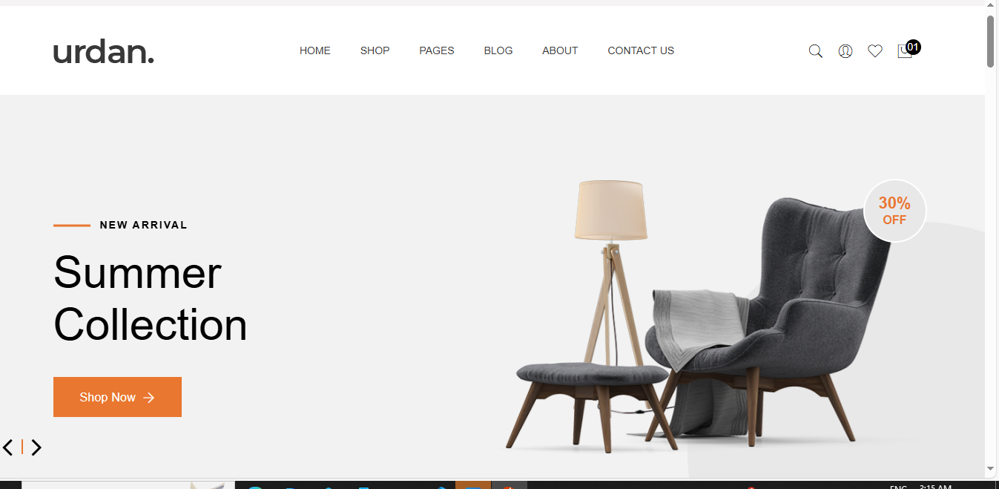
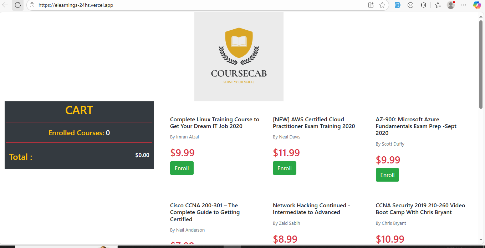
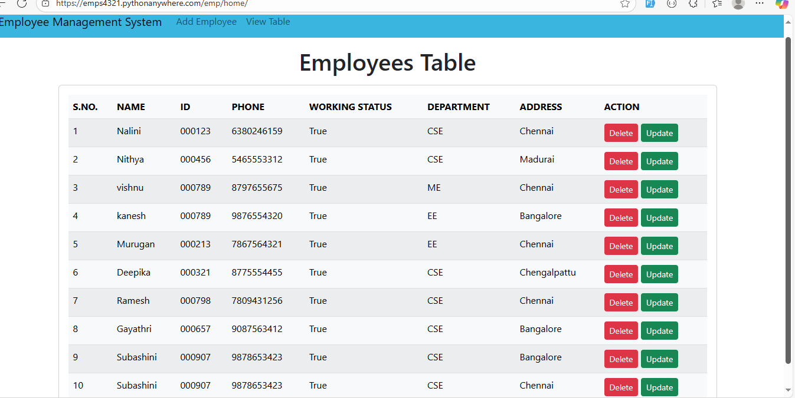
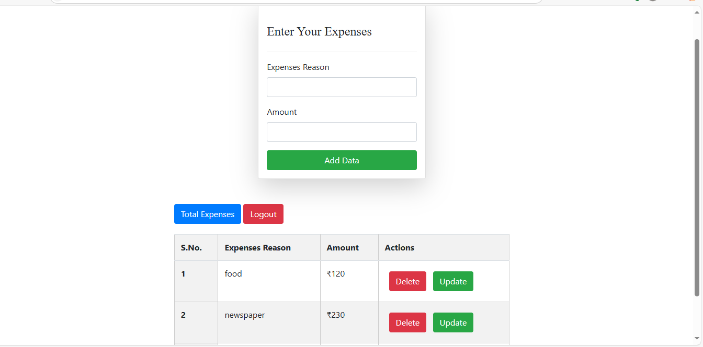

## Nalini Portfolio
A modern and responsive personal portfolio built with React, TypeScript, and Tailwind CSS.  
Showcases my skills, projects, and experience in front-end development and UI design.  
Designed to be fast, accessible, and visually engaging across all devices.  
Explore my work and get in touch for collaboration or opportunities.

## Project Info
This is a personal portfolio project showcasing web development skills, projects, and experience. Built with modern technologies for fast, responsive, and beautiful user experience.
## How to Edit the Code
You can edit this project using your favorite IDE or code editor. To get started:
```sh
# Step 1: Clone the repository using your project's Git URL.
git clone <YOUR_GIT_URL>
# Step 2: Navigate to the project directory.
cd <YOUR_PROJECT_NAME>
# Step 3: Install the necessary dependencies.
npm install
# Step 4: Start the development server for instant preview and auto-reloading.
npm run dev
```
## Technologies Used
## Technologies Used
 - Vite
 - TypeScript
 - React
 - shadcn-ui
 - Tailwind CSS

## Project Screenshots

Here are some screenshots from the portfolio:








## How to Deploy
You can deploy this project using your preferred hosting platform. For static hosting, build the project and upload the output from the `dist` folder.
## Custom Domain Setup
To connect a custom domain, refer to your hosting provider's documentation for domain configuration and DNS setup.
---
Feel free to customize this portfolio to reflect your own style and achievements!

- Navigate to the main page of your repository.
- Click on the "Code" button (green button) near the top right.
- Select the "Codespaces" tab.
- Click on "New codespace" to launch a new Codespace environment.
- Edit files directly within the Codespace and commit and push your changes once you're done.

## What technologies are used for this project?

This project is built with:

- Vite
- TypeScript
- React
- shadcn-ui
- Tailwind CSS

